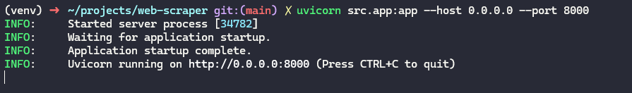
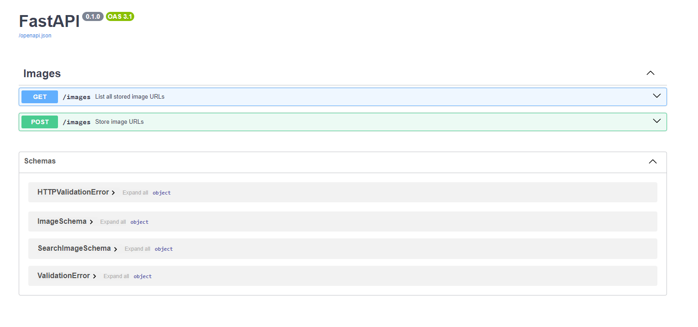
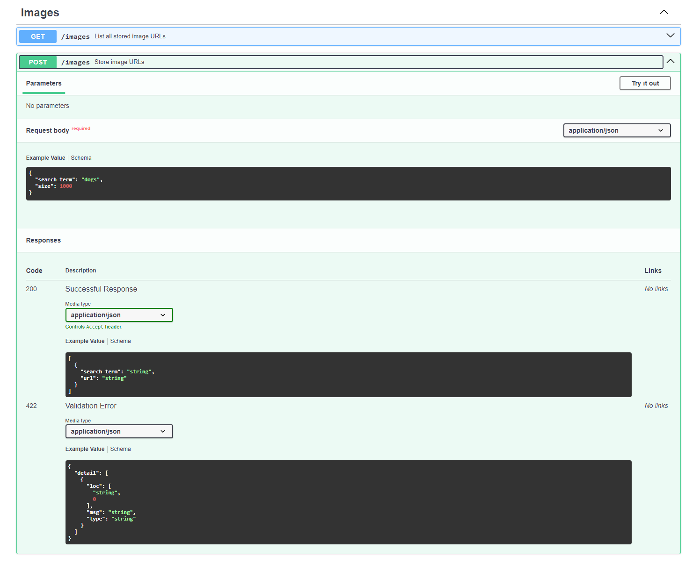
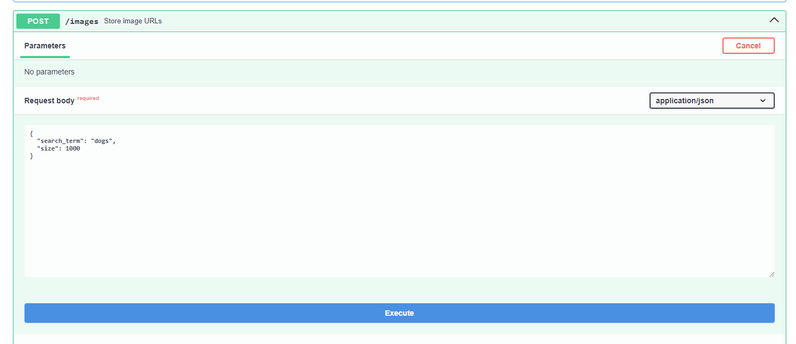
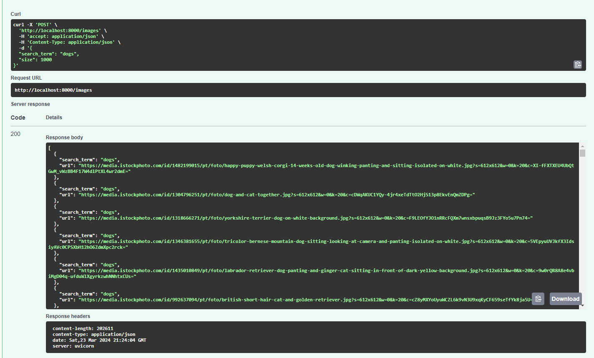
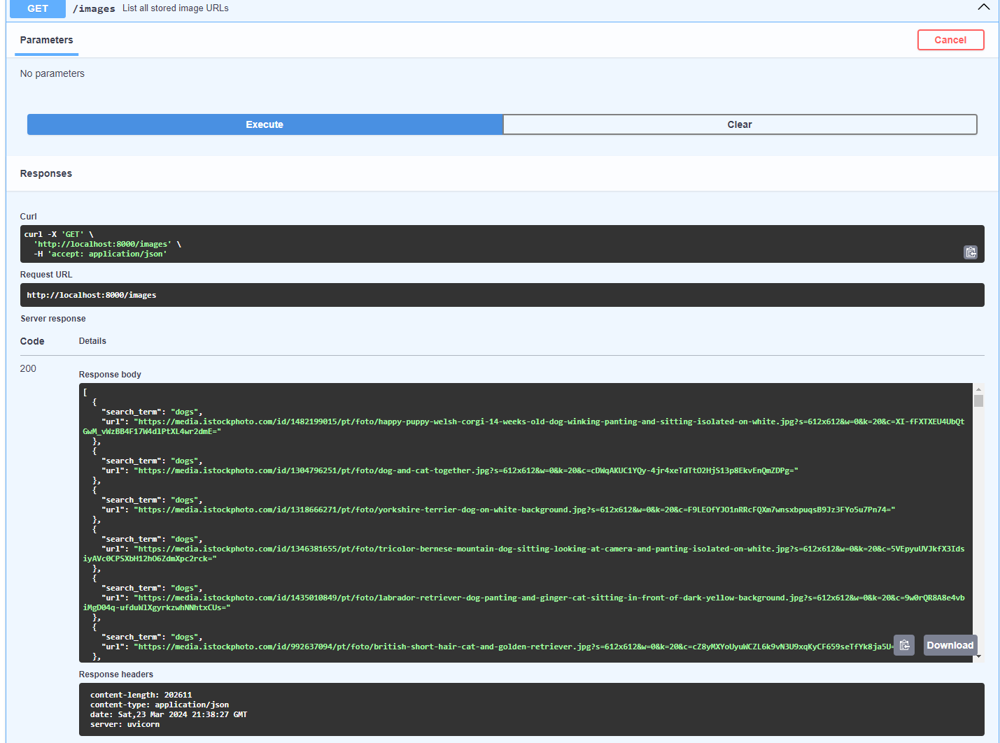
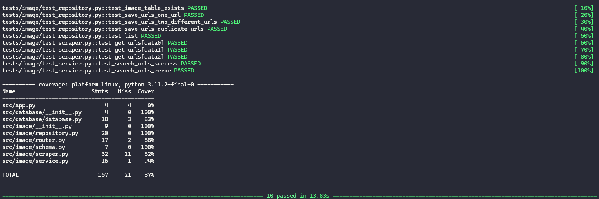

# Introduction

This is a simple Selenium Web Scraper that is run through FastAPI.
The Web Scraper search N images for a given search term and stores their URLs from <https://www.freeimages.com> to a SQLite Database. By default it is searching for 1000 dog images.

## How to run

There are two recommended ways to run this project.

1. Using Docker
2. Running Python locally

### Docker (Recommended)

#### Prerequisites

* Docker version 25+

#### Instructions

This projected was developed using Docker version 25.0.3. Make sure you have a compatible version and then run the following command:

> docker compose up --build -d

The FastAPI server should be up and running. Go to the next steps to see how to use the API.

### Running Python

#### Prerequisites

* Python 3.11+
* Chrome and Chromedriver

#### Instructions

It is recommended to create a virtual environement to install all the dependencies. After you setup your virtal environment run the following commands:

> pip install -r requirements/requirements.txt

If you want to run the tests you also have to install the tests requirements

> pip install -r requirements/requirements-test.txt

You need to have compatbile versions of Chrome and Chromedriver in your PYTHONPATH.

The API can be started with following command:

> uvicorn src.app:app --host 0.0.0.0 --port 8000

You should see this in your terminal

### How to use the API

Go to <http://localhost:8000/docs>. You should see the following website.

Open the POST request from /images

Click on "Try it out"

You can now edit the parameters as you see fit.

When you're satisfied click on execute and wait for the Web Scraper to finish running.

All the URLs have been saved to the SQLite Database. You can see all the stored results using the GET /images endpoint.

### Environment Variables

There are two environment variables that can change the behavior of the application.

#### Environment

The "Environment" variable is used to decide if chrome is going to run in headless mode or not. By default the variable value is "production" which means it's going to run in headless mode. Any other value will deactive headless mode.

#### DATABASE_PATH

This variable allows you to specify where the database file generated by SQLite should be. By default it is NOT set and will run the database in memory.

### Tests

To run tests make sure you installed all the dependencies in the Python step and run the following command:

> pytest -vv --cov=src

You should see a similar result

